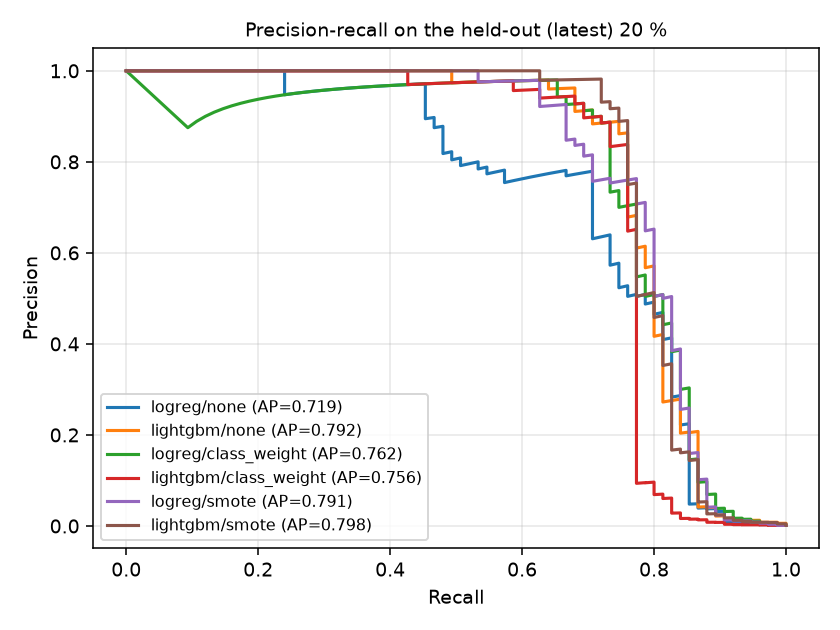
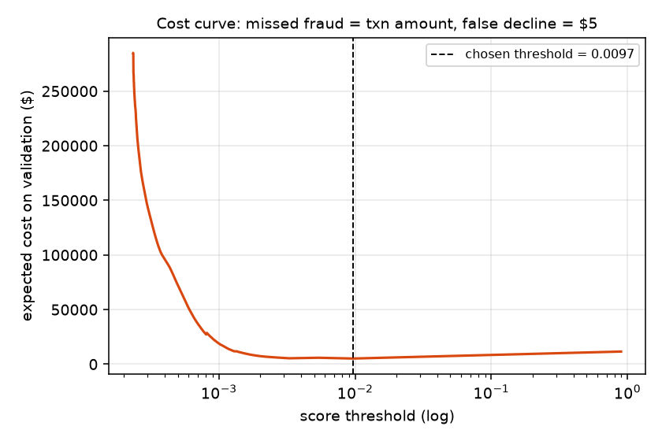

# fraud-detection-pipeline

End-to-end card-fraud detection built the way a fraud analytics team would actually use it: a chronological
train/validation/test split, backward-looking velocity features, three class-imbalance strategies compared
head-to-head, LightGBM against a logistic-regression baseline, **an operating threshold chosen from a cost matrix**
(missed fraud costs the transaction amount, a false decline costs a fixed review fee), SHAP explanations, and a
Streamlit queue where an analyst reviews flagged transactions and logs a decision.

Every number below is written by `python run.py` into `results/` (`results_table.md`, `metrics.json`) - nothing is typed by hand.

## Problem

A card issuer sees ~0.17 % fraud. A model that is 99.8 % "accurate" by predicting *never fraud* is useless, and
ROC-AUC barely moves between good and great models at this imbalance. The questions that matter operationally are:

1. At a review budget the fraud team can staff, how much fraud (in dollars) do we catch?
2. Which imbalance trick actually helps once the threshold is tuned for cost, rather than just moving the threshold around?
3. Can an analyst see *why* a transaction was flagged?

## Data

**ULB Credit Card Fraud** - 284,807 transactions by European cardholders over two days in September 2013, 492 frauds
(0.173 %). Columns: `Time` (seconds since the first transaction), `Amount`, `V1..V28` (PCA components - the raw
merchant/card fields are anonymised), `Class`. The pipeline downloads it from OpenML (dataset 1597 - the same file
as Kaggle's `creditcardfraud`) so no Kaggle login is needed.

> **Why not IEEE-CIS?** The IEEE-CIS competition data requires a Kaggle login and rules acceptance, which a clean clone
> can't do. ULB was the documented fallback. The consequence: there are no card, device or merchant identifiers, so the
> velocity features here are computed on a *global* key ("how busy is the system right now"). The same functions take a
> `key_col` and produce per-card / per-device velocity on data that has one (`tests/test_features.py` covers that path).

## Method

| Step | What | Why |
|---|---|---|
| Split | first 60 % of time -> train, next 20 % -> validation, last 20 % -> test (no shuffling) | velocity features look backwards in time; a random split leaks the future into training |
| Features | hour of day, night flag, log amount, round-amount flags; trailing 1h / 6h / 24h transaction counts and amount sums; seconds since previous transaction; amount z-score vs. the trailing 24h (`src/fraudpipe/features.py`) | strictly backward-looking windows via `searchsorted` - a transaction only sees earlier ones |
| Imbalance | `none` (raw), `class_weight` (LogReg `balanced`, LightGBM `scale_pos_weight` = 474), `smote` (5 % minority ratio on the training fold only) | isolate what the *training* trick buys once every model gets a cost-tuned threshold |
| Models | logistic regression (scaled, C=0.5) and LightGBM (lr 0.02, 31 leaves, early stopping on validation PR-AUC) | an explainable baseline vs. the usual tabular winner |
| Threshold | grid over validation scores, pick the one minimising `sum(missed fraud amounts) + $5 x (false declines + true positives)`; freeze it, then score the test slice | a threshold tuned on the test set would overstate results |
| Explain | SHAP `TreeExplainer` on 3,000 test rows -> `results/shap_importance.png`; per-transaction contributions in the app | analysts need a reason, not a score |
| Review | `app/streamlit_app.py`: queue sorted by score, filters, SHAP bar per transaction, Confirm / Legit / Hold buttons -> `results/review_decisions.csv` | closes the loop from model to human decision |

## Results (test = latest 20 % of transactions: 56,962 rows, 75 frauds)

Threshold per row is the cost-optimal one found on validation. Sorted by expected cost on the test slice (lower is better).

| model | strategy | AUC-PR | AUC-ROC | threshold | precision | recall | F1 | alerts | alerts / 10k | fraud $ caught | fraud $ missed | expected cost |
|---|---|---|---|---|---|---|---|---|---|---|---|---|
| lightgbm | none | 0.792 | 0.987 | 0.0097 | 0.394 | 0.813 | 0.530 | 155 | 27.2 | $5,339 | $2,391 | $3,166 |
| logreg | class_weight | 0.762 | 0.983 | 0.9499 | 0.294 | 0.853 | 0.437 | 218 | 38.3 | $5,362 | $2,367 | $3,457 |
| logreg | none | 0.719 | 0.963 | 0.0172 | 0.284 | 0.840 | 0.424 | 222 | 39.0 | $5,364 | $2,365 | $3,475 |
| lightgbm | class_weight | 0.756 | 0.938 | 0.8124 | 0.389 | 0.773 | 0.518 | 149 | 26.2 | $4,846 | $2,883 | $3,628 |
| lightgbm | smote | 0.798 | 0.984 | 0.0721 | 0.222 | 0.827 | 0.350 | 279 | 49.0 | $5,356 | $2,373 | $3,768 |
| logreg | smote | 0.791 | 0.973 | 0.1065 | 0.181 | 0.853 | 0.299 | 353 | 62.0 | $5,367 | $2,362 | $4,127 |

Chosen operating point: **LightGBM, no resampling, threshold 0.0097** - catches 61 of 75 frauds (81 % recall) at 39 %
precision, i.e. 155 alerts for 56,962 transactions (27 per 10,000), $5,339 of $7,730 fraud dollars caught.

Top SHAP features (mean |SHAP|, LightGBM): V14 (0.228), V4 (0.128), V12 (0.045), V7, V20, V19, Amount, V3 - consistent with
the EDA, where V17/V14/V12/V10 separate the classes by 5-8 standard deviations (`notebooks/01_eda.ipynb`).

 

## Key decisions

- **PR-AUC and a cost-tuned threshold, not ROC-AUC.** Every model here has ROC-AUC > 0.93; the operational
  difference between them is a $1,000 spread in expected cost and a 2x spread in analyst workload (149 vs 353 alerts).
- **Cost matrix instead of F1.** F1 treats a missed $2,000 fraud and a $3 false decline the same. With missed
  fraud = transaction amount and $5 per review, the optimiser accepts lower precision to catch expensive fraud.
  `--fp-cost` changes the trade-off; the cost curve in `results/cost_curve.png` shows how flat the optimum is.
- **SMOTE did not pay for itself.** It raised PR-AUC slightly for both models but the cost-optimal threshold then
  produced 1.8-2.3x more alerts for the same recall. Synthetic positives are interpolations of real ones; they make the
  score distribution smoother, not the decision better. Class weighting hurt LightGBM (ROC-AUC 0.938, early stop at
  57 trees) - with `scale_pos_weight` = 474 the loss is dominated by 360 positives and the model overfits them.
- **Chronological split.** 360 / 57 / 75 frauds in train / val / test. Random stratified splitting would have looked
  better and been wrong for a model with time-window features.

## Limitations (say these out loud in the interview)

- **75 test frauds.** A 0.79 vs 0.76 AUC-PR difference is within sampling noise; the ranking of models could change
  with a different two-day window. The right fix is more data or repeated time-based folds.
- **PCA features are not explainable to a business user.** "V14 was very negative" is a real reason, but it can't be
  mapped to "merchant category" or "distance from home". On production data the SHAP output would name real fields.
- **Global velocity only** (see Data). Per-card velocity is usually the strongest feature family in card fraud.
- **Static cost matrix.** Real false-decline costs depend on the customer (attrition risk), and real fraud losses
  depend on chargeback rules. Both are inputs the model should take from the business, not constants in code.
- **No drift monitoring** - see the companion repo `model-risk-monitoring`.

## How to run

```bash
git clone https://github.com/lukefreyman-ai/fraud-detection-pipeline && cd fraud-detection-pipeline
make setup          # python3 -m venv .venv && pip install -r requirements.txt   (LightGBM on macOS may need: brew install libomp)
make run            # downloads the data (~150 MB, once), trains 6 models, writes results/ and models/   (~1 min)
make test           # pytest: feature windows, cost threshold, end-to-end smoke on synthetic data
make app            # Streamlit review queue at http://localhost:8501
make notebook       # builds and executes notebooks/01_eda.ipynb
make quick          # 20 % sample, ~15 s, results_quick/
```

`python run.py --fp-cost 10` re-tunes thresholds for a more expensive false decline; `--strategies none,class_weight` skips SMOTE.

## Repo layout

```
run.py                     pipeline entry point (writes results/, models/)
src/fraudpipe/data.py      OpenML ARFF download + chronological split + synthetic frame for tests
src/fraudpipe/features.py  time + backward-looking velocity features (keyed or global)
src/fraudpipe/imbalance.py none / class_weight / smote
src/fraudpipe/models.py    logistic regression + LightGBM (early stopping)
src/fraudpipe/evaluate.py  PR-AUC, ROC-AUC, cost matrix, threshold search
src/fraudpipe/explain.py   SHAP global importance + per-transaction contributions
src/fraudpipe/report.py    results table / plots
app/streamlit_app.py       analyst review queue
notebooks/01_eda.ipynb     executed EDA (build with notebooks/build_eda.py)
tests/                     8 tests, run in ~5 s
results/                   committed outputs of the last full run
```
